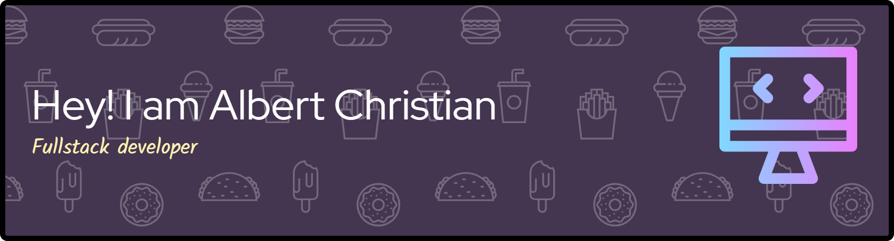

<h1 align="center">🚀 Hey there, I'm Albert Christian 👋</h1>
<h3 align="center">💻 Information Systems Student | Politeknik Caltex Riau | Code Ninja in Training 🧑‍💻</h3>

  

---

### 🌐 Connect with Me

  
  
  
  

---

### ⚙️ Tech Stack & Tools

  
  
  
  
  
  
  
  
  
  
  
  
  
  
  

---

### 📊 GitHub Stats & Activity

  

  

  

  

---

### ✨ About Me
- 🎓 Currently studying **Information Systems at Politeknik Caltex Riau**
- 💡 Passionate about **Web Development, UI/UX Design, Game Development, and AI/ML** – always tinkering with the latest tech!
- 🚀 Love building **full-stack apps, interactive games, and sleek designs**. My motto: "Code is poetry in motion." 📝
- 🎮 Hobbies: Coding marathons, gaming (especially indie titles), and binge-watching tech talks on YouTube.
- 🌟 Open to collaborations, internships, or just chatting about tech over coffee ☕. Let's innovate!

---

### 🧠 Fun Tech Facts & Quirks
- ⚡ I can debug code faster than I can brew coffee ☕ – but I still love both!
- 🎨 Obsessed with **minimalist design** and **dark mode** everywhere. Light mode? No thanks! 🌙
- 🎮 Built my first game in Unity at 18 – now dreaming of VR worlds. What's your favorite game?
- 💪 "Consistency beats motivation" – but a good playlist (lo-fi beats) helps! 🎧
- 🤖 Fun fact: I'm experimenting with AI tools like ChatGPT for coding assistance. The future is now! 🚀

---

### 🚀 Currently Working On & Learning
- 🔧 **Project Spotlight**: Building a **React-based dashboard** for data visualization (check my repos!).
- 📚 **Learning Journey**: Diving deep into **Next.js, TypeScript, and Cloud Computing** (AWS certified soon? 🤞).
- 🎯 **Goals**: Contribute to open-source, land a tech internship, and create an app that changes the world (or at least makes coding fun).

---

### 🏆 Featured Projects

  
  
  
  <a href="https://github.com/KeijiChoco14/ai-chatbot" target="_blank"> <!-- Tambahkan proyek baru -->
    
  </a>

---

  

  

---

  
   
  
  

  

